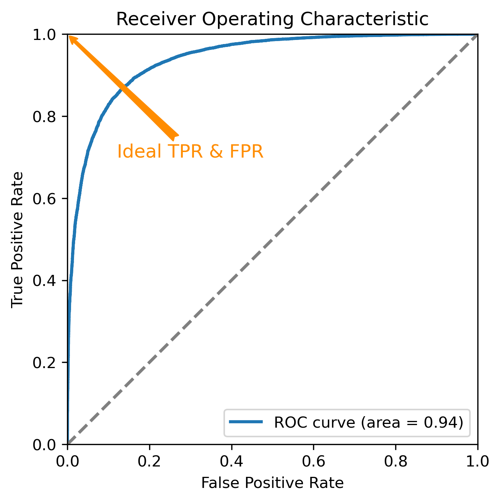

# Binary Hypothesis Test

[toc]

## Basic Definitions

***Null hypothesis*** $H_0$ is used to say that there is no effect or no difference. e.g.

* When testing a new drug, $H_0$ would be "The new drug has no effect."
* When comparing two teaching methods, $H_0$ would be "Both methods have the same effect on student performance."
* When discussing whether God exits, $H_0$ would be "There is no God."
* When estimating the mean of a univariate Gaussian distribution, $H_0$ would be $\mu=0$.

***Alternative hypothesis*** $H_1$ is used to say something contradicting to $H_0$.

* When testing a new drug, $H_1$ would be "The new drug improves the treatment." e.g.
* When comparing two teaching methods, $H_1$ would be "Method A is better than method B in improving student performance."
* When discussing whether God exits, $H_1$ would be "The God exists."
* When estimating the mean of a univariate Gaussian distribution, $H_1$ would be $\mu=1$ or $\mu>0$.

***Confusion matrix*** categorizes the prediction into four quadrants.

* ***true negative***:&nbsp; predict $H_0$ while $H_0$ is true.
* ***false negative***: predict $H_0$ while $H_1$ is true.
* ***false positive***:&nbsp; predict $H_1$ while $H_0$ is true.
* ***true positive***:&nbsp;&nbsp; predict $H_1$ while $H_1$ is true.

| confusion matrix |     $H=H_0$    |     $H=H_1$    |
|------------------|----------------|----------------|
|  $\hat{H}=H_0$   | true negative  | false negative |
|  $\hat{H}=H_1$   | false positive | true positive  |

where $H$ denotes the true hypothesis and $\hat{H}$ denotes the predicted hypothesis.

Examples:

* After testing a new drug, we conclude that it improves the treatment while in fact it doesn't. $\to$ false positive.
* After discussing whether God exits, we conclude that God doesn't exist while The God does exist (in Jerusalem). $\to$ false negative.

***Loss Function*** (or ***cost function***) penalizes wrong prediction. Let
$$
\ell(\hat H = H_i, H = H_j) \triangleq \ell_{ij}, \quad i,j \in \{0,1\}
$$
denote the cost of predicting $H_i$ while $H_j$ is true.

* We choose $\ell_{ij}$ such that $\ell_{00} < \ell_{10}$ and $\ell_{11} < \ell_{01}$. There is no reason to penalize correct prediction more than wrong prediction.
* The loss could be asymmetric. e.g. We can penalize FN higher than FP by setting $\ell_{01} > \ell_{10}$. Such design could be useful in fire alarms as FN risks lives.
* One special case is the 0/1 loss, defined by setting
    $$
    \ell_{ij} = \mathbb{I}[i=j] =
    \begin{cases}
    0 & \text{ if } i = j \\
    1 & \text{ if } i\ne j \\
    \end{cases}
    $$

|   loss function  |     $H=H_0$    |     $H=H_1$    |
|------------------|----------------|----------------|
|  $\hat{H}=H_0$   |   $\ell_{00}$  |   $\ell_{01}$  |
|  $\hat{H}=H_1$   |   $\ell_{10}$  |   $\ell_{11}$  |

***Data*** $D$: To predict whether $H_0$ or $H_1$ is true. We need data set $D=[x_1, \dots, x_N]$.

* $x_1, \dots, x_N$ are elements from ***feature space*** $\mathcal{X}$, e.g. $\mathcal{X} = \mathbb{R}$ or $\mathcal{X} = \mathbb{R}^d$
* Standard assumption: $x_1, \dots, x_N$ are drawn iid from some distribution $p_X(\cdot)$.
* The data set $D$ is an element from ***data space*** (or ***observation space***) $\mathcal{D} \triangleq \mathcal{X}^N$. In other words, the obervation space consists of all possible data sets.

Special cases:

* $\mathcal{X} = \mathbb{R} \implies \mathcal{D} = \mathbb{R}^N$. e.g. Binary hypothesis test on $\mu$ based on $N$ observations, where $\mu$ is the unknown mean of a univariate Gaussian.
* $N=1 \implies \mathcal{D} = \mathcal{X}$. i.e. data space coincides with feature space. e.g. binary classification for a single data point.

***Statistics* (optional reading)** $T$ can be anything we can calculated from $D$. Some popular choices are

* data vector: $T=D=[x_1, \dots, x_N]$. Just take collect all samples in a vector.
* sample mean: $T=\frac{1}{N}(x_1 + \dots + x_N)$, often denoted by $\bar x$.
* sample variance: $T=\frac{1}{N-1}[(x_1 - \bar{x})^2 + \dots + (x_N - \bar{x})^2]$ if  $x_n$ are scalars.

Throughout this article, we use data vector as our statistics. i.e. $T$ and $D$ coincide.  

***Probabilities***: There are three major probabilities of paricular interest

* ***Prior probability***  $p(H_i)$: our prior belief in hypothesis $H_i$ before seeing any data.
* ***Likelihood***  $p(D \mid H_i)$: the distributinon of data $D$ if $H_i$ is true. Thanks to iid assumption, we can factorize
    $$
    \begin{align}
    p(D \mid H_i)
    &= p(x_1, \dots, x_N \mid H_i) \\
    &= \prod_{n=1}^N p(x_n \mid H_i)
    \end{align}
    $$
* ***Posterior probability***  $p(H_i \mid D)$: our updated belief in $H_i$ after observing $D$. Using the Bayes rule, we know
    $$
    \begin{align}
    p(H_i \mid D)
    &=       p(D \mid H_i) \frac{p(H_i)}{p(D)} \\
    &\propto p(D \mid H_i)  p(H_i)
    \end{align}
    $$

***Decision rule*** is a function which maps the data set to one candidate hypothesis
    $$
    \begin{align*}
    h: \mathcal{D} &\to \{H_0, H_1 \}, \\
    D              &\mapsto \hat H = h(D) = h(x_1, \dots, x_N)
    \end{align*}
    $$

The decision rule partions the observation space $\mathcal{D}$ into two regions

* $\mathcal{D}_0 \triangleq \{[x_1, \dots, x_N]\in\mathcal{D} : \hat H = H_0 \}$. i.e. the region where we predict $H_0$.
  * If $N$ happens to be 1, we also denote this region by $\mathcal{X}_0$.
* $\mathcal{D}_1 \triangleq \{[x_1, \dots, x_N]\in\mathcal{D} : \hat H = H_1 \}$. i.e. the region where we predict $H_1$. In statistics, this is also known as ***critical region***. (just another statistical fanncy name)
  * If $N$ happens to be 1, we also denote this region by $\mathcal{X}_1$.

## Decision Methods

Given the data set $D$, how to design a *good* decision rule?

Well, this depends the definition of "good". The optimal prediction depends on what we want to optimize. In the following, we will see that a lot of decision rules can be formulated as thresholding log likelihood ratio.

### Maximum Likelihood (ML) Decision

The ML picks the hypothesis, which make the data most probable. Here, we have only two hypothesis, we can decide the optimal prediction simply by thresholding likelihood ratio
$$
\frac{p(D \mid H_0)}{p(D \mid H_1)}
\:\underset{H_1}{\overset{H_0}{\gtrless}}\: 1
$$
or equivalently thresholding log likelihood ratio
$$
\ln\frac{p(D \mid H_0)}{p(D \mid H_1)}
\:\underset{H_1}{\overset{H_0}{\gtrless}}\: 0
$$

Remark:

* ML is asymptotically optimal. If the data set $D$​​ is large enough, we can guarantee to predict the true hypothesis (convergence in probability). Theoretical analysis of ML is omitted here.
* ML balances between TPR and FPR. c.f. later.
* ML could suffer from small data set. e.g. We toss a coin only twice and get two heads. ML would predict that the coin is 100% biased, which might be overconfident about the nature of the coin. To address this problem, frequentists extend the data set by assuming some "hypothetical" data (details not part of this article). Bayesian add prior probability, which yields MAP.

### Maximum a Posteriori (MAP) Decision

The MAP pickes the most probable hypothesis given the data. Once again, since we have only two hypothesis, we can simply threshold posterior ratio
$$
\frac{p(H_0 \mid D)}{p(H_1 \mid D)}
\:\underset{H_1}{\overset{H_0}{\gtrless}}\: 1
$$
which is equivalent to any of

1. thresholding likelihood ratio
    $$
    \frac{p(D \mid H_0)}{p(D \mid H_1)}
    \:\underset{H_1}{\overset{H_0}{\gtrless}}\:
    \frac{p(H_1)}{p(H_0)}
    $$

1. thresholding log likelihood ratio
    $$
    \ln\frac{p(D \mid H_0)}{p(D \mid H_1)}
    \:\underset{H_1}{\overset{H_0}{\gtrless}}\:
    \ln\frac{p(H_1)}{p(H_0)}
    $$

Remark:

* MAP differs from ML only by the threshold for the log likelihood ratio
* MAP reduces to ML for equal priors $p(H_0) = p(H_1)$.
* MAP outperforms ML when the data set $D$ is small AND the priors are accurate.

### Minimum Bayesian Risk (MBR) Decision

Suppose we have a loss function $\ell_{i,j}$. One natual prediction would be the $H_i$ with least averaged loss, which leads to minimizing Bayesian risk.

***Bayesian risk*** for predicting $H_i$ is defined as the expcted loss w.r.t. the posterior.
$$
\begin{align}
R(H_i)
&= \ell_{i0}\cdot p(H_0 \mid D) + \ell_{i1}\cdot p(H_1 \mid D) \\
&\propto \ell_{i0}\cdot p(D \mid H_0) p(H_0) + \ell_{i1}\cdot p(D \mid H_1) p(H_1)
\end{align}
$$

***Decision Making***: The optimal decision is made by minimizing Bayes risk. i.e. We predict $H_i$ whose $R(H_i)$ is lower than the other. Formally, the decision rule is
$$
\begin{align}
R(H_1) \:\underset{H_1}{\overset{H_0}{\gtrless}}\: R(H_0)  
\end{align}
$$

which is equivalent to any of followings

1. Thresholding posterior ratio
    $$
    \frac{p(H_0 \mid D)}{p(H_1 \mid D)}
    \:\underset{H_1}{\overset{H_0}{\gtrless}}\:
    \frac{\ell_{01} - \ell_{11}}{\ell_{10} - \ell_{00}}
    $$
1. Thresholding likelihood ratio
    $$
    \frac{p(D \mid H_0)}{p(D \mid H_1)}
    \:\underset{H_1}{\overset{H_0}{\gtrless}}\:
    \frac{\ell_{01} - \ell_{11}}{\ell_{10} - \ell_{00}} \frac{H_1}{H_0}
    $$
1. Thresholding log likelihood ratio
    $$
    \ln\frac{p(D \mid H_0)}{p(D \mid H_1)}
    \:\underset{H_1}{\overset{H_0}{\gtrless}}\:
    \underbrace{\ln\frac{\ell_{01} - \ell_{11}}{\ell_{10} - \ell_{00}} }_{\gamma_L}
    +
    \underbrace{\ln\frac{H_1}{H_0}}_{\gamma_P}
    $$

Remark:

* Bayes risk minimization reduces to MAP estimate of $H$​ if we use 0/1 loss. (*Proof*: just plug-in 0/1 loss in threshold for posterior ratio)
* The threshold for log likelihood ratio depends on loss function ($\gamma_L$) and prior ($\gamma_P$).

### Minimax Decision

In some applications, minimizing the **averaged** loss is not what we really care about. Instead, we want to choose the hypohesis which minimizes the **worst-case** loss. This motive leads to minimax decision rule. For each prediction $H_i$, the worst-case cost is
$$
\max_j \ell_{ij}
$$
To minimise the worst-case cost, we choose $H_k$ such that
$$
\max_j \ell_{kj} = \min_i \max_j \ell_{ij}
$$
The index notation might looks confusing but the expanded notaiton might be clearer. The minimax decision is $\hat H$ s.t.
$$
\max_j \ell(\hat H, H_j) = \min_{i} \max_{j} \ell(H_i, H_j)
$$
*Example*: You are deciding whether to invest in a project. Let $H_0$ be "do not invest" and $H_1$ be "invest".

* If you choose not to invest, the cost will always be zero.
* If you invest, you will either lose 10 or win 20.

The cost function is summarized in the table (Note: costs are positive vs. profits are negative!). Suppose you know the posterior probability $p(H_1 \mid D) = 0.4$.

| Loss function           | $H=$ do not invest | $H=$ invest | **Averaged cost** | **Worst case cost** |
| ----------------------- | ------------------ | ----------- | ----------------- | ------------------- |
| $\hat H=$ do not invest | 0                  | 0           | $0$               | $\boxed{0}$         |
| $\hat H=$ invest        | 10                 | -20         | $\boxed{-2}$      | $10$                |

How good/bad is minimax decision?  $\to$ By minimax theorem
$$
\max_j \min_i\ell_{ij} \le \min_i \max_j \ell_{ij}
$$
We know that the minimax decision costs at least $\max_j \min_i\ell_{ij}$.

### Neyman-Pearson (NP) Decision

Before you learn NP decision, read next section to see how to derive TPR and FPR from decision rules.

NP decision maximizes TPR while fixing the FPR to some pre-defined value $\alpha$. Formally, this is
$$
\begin{align*}
\max_{\mathcal{D}_1} & \int_{\mathcal{D}_1} p(D \mid H_1) \\
\text{s.t.} & \int_{\mathcal{D}_1} p(D \mid H_0) = \alpha
\end{align*}
$$

One can show that NP decision is equivalent to thresholding the log likelihood ratio
$$
\ln\frac{p(D \mid H_0)}{p(D \mid H_1)}
\:\underset{H_1}{\overset{H_0}{\gtrless}}\:
\gamma_\alpha
$$
with $\gamma_\alpha$ depending the desired false positive rate $\alpha$. Proof omitted.

## Critical Region

We have seen that ML, MAP, MBR and NP share the same form of decision rule, which is thresholding the log likelihood ratio.

$$
\ln\frac{p(D \mid H_0)}{p(D \mid H_1)}
\:\underset{H_1}{\overset{H_0}{\gtrless}}\:
\gamma
$$

Remark:

* For ML, simply set $\gamma = 0$
* For MAP, $\gamma = \gamma_P$ depends on the prior
* For MBR, $\gamma = \gamma_P + \gamma_L$ depends on the prior and loss function
* For NP, $\gamma$ depends on the desired false positive rate $\alpha$

Therefore, we can study their critical region under the same framework. Recall: critical region is the subset of the obsevation space where we predict $H_1$, i.e.
$$
\mathcal{D}_1 =
\left\{
    D \in\mathcal{D} :
    \hat H = H_1
\right\}
$$

Hence, the critical region becomes
$$
\mathcal{D}_1 =
\left\{
    D \in\mathcal{D} :
    \ln\frac{p(D \mid H_0)}{p(D \mid H_1)} < \gamma
\right\}
$$
or equivalently
$$
\mathcal{D}_1 =
\left\{
    [x_1, \dots, x_N] \in\mathcal{X}^N :
    \ln\frac{p(x_1, \dots, x_N \mid H_0)}{p(x_1, \dots, x_N \mid H_1)} <
    \gamma
\right\}
$$

Common assumption: $x_1, \dots, x_N$ are iid. Using the nature of log, we get
$$
\mathcal{D}_1 =
\left\{
    [x_1, \dots, x_N] \in\mathcal{X}^N :
    \sum_{n=1}^N \ln p(x_n \mid H_0) - \sum_{n=1}^N \ln p(x_n \mid H_1) <
    \gamma
\right\}
$$
If the data set is singleton $D=\{x\}$, the critical region simplies to
$$
\mathcal{D}_1 =
\left\{
    x \in\mathcal{X} :
    \ln p(x \mid H_0) - \ln p(x \mid H_1) <
    \gamma
\right\}
$$

Remarks:

* As $\gamma$ increases, the critical region expands since the inequality is easier to be satisfied.
* Replacing the inequality sign by equality sign in the formula yields the decision boundary in observation space.
* The fundamental shape of decision boundary only depends on the likelihood $p(\cdot \mid H_0)$ and $p(\cdot \mid H_1)$.
* The loss function, the priors, and $\alpha$ in NP only shift the decision boundary but do not change the shape of it.

## Evaluation Metrics

In this section, we focus on two metrics to evaluate a decision rule which predicts $\hat H$ from $D=[x_1, \dots, x_N]$.

* true positve rate (or recall), denote by
  $$
  \mathrm{TPR} = \frac{P(\hat H = H_1, H = H_1)}{P(H = H_1)}
  $$
* false positive rate (or false alarm rate), denote by
  $$
  \mathrm{FPR} = \frac{P(\hat H = H_1, H = H_0)}{P(H = H_0)}
  $$

### True Positive Rate

Using the property of conditional distribution and the decision rule, we conclude that TPR is obtained by integrating the likelihood $p(D \mid H_1)$ over the "positive region" $\mathcal{D}_1$.
$$
\begin{align*}
\mathrm{TPR}
&= P(\hat H = H_1 \mid H = H_1) \\
&= P(D\in\mathcal{D}_1 \mid H = H_1) \\
&= \int_{\mathcal{D}_1} p(D \mid H_1)  \:\mathrm d D
\end{align*}
$$

The TPR can be simplified further by factorizing the likelihood
$$
\begin{align*}
\mathrm{TPR}
&= \int_{\mathcal{D}_1} p(x_1 \dots x_N \mid H_1)  \:\mathrm d x_1 \dots x_N \\
&= \int_{\mathcal{D}_1} \prod_{n=1}^N p(x_n \mid H_1)  \:\mathrm d x_1 \dots x_N
\end{align*}
$$

In general, the region $\mathcal{D}_1$ can be very complex. Even if the decision boundary is linear (i.e. $\mathcal{D}_1$ is a half space), this integral still can't be factorized into the product of $N$​ simpler integrals.

Special case: For $N=1$, the TPR becomes
$$
\mathrm{TPR} = \int_{\mathcal{X}_1}  p(x \mid H_1)  \:\mathrm d x
$$

### False Positive Rate

Using the property of conditional distribution and the decision rule, we conclude that TPR is obtained by integrating the likelihood $p(D \mid H_0)$ over the "positive region" $\mathcal{D}_1$.
$$
\begin{align*}
\mathrm{FPR}
&= P(\hat H = H_1 \mid H = H_0) \\
&= P(D\in\mathcal{D}_1 \mid H = H_0) \\
&= \int_{\mathcal{D}_1} p(D \mid H_0)  \:\mathrm d D
\end{align*}
$$

The TPR can be simplified further by factorizing the likelihood
$$
\begin{align*}
\mathrm{FPR}
&= \int_{\mathcal{D}_1} p(x_1 \dots x_N \mid H_0)  \:\mathrm d x_1 \dots x_N \\
&= \int_{\mathcal{D}_1} \prod_{n=1}^N p(x_n \mid H_0)  \:\mathrm d x_1 \dots x_N
\end{align*}
$$

Once again, this integral can't be factorized into the product of $N$​ simpler integrals.

Special case: For $N=1$, the TPR becomes
$$
\mathrm{FPR} = \int_{\mathcal{X}_1}  p(x \mid H_0)  \:\mathrm d x
$$

## ROC Curve

Ideally, we would like to maximize TPR and simultaneously minimize FPR. However, there is a trade off:

* If we choose a large $\gamma\implies$ large critical region $\implies$ both TPR and FPR becomes large.
* If we choose a small $\gamma\implies$ small critical region $\implies$ both TPR and FPR becomes small.

How to find the best balance? That is why ROC curve comes to play.

The name receiver operating characteristic (ROC) curve was a leftover from World War II. It was originally developed to detect enemy aircrafts from radar signals. The basic idea of ROC is to visualize all possible pairs of TPR and FPR for every possible $\gamma$.

To make TPR and FPR explicitly dependent on $\gamma$, we reformulate them with indicator function
$$
\begin{align*}
\mathrm{TPR}(\gamma)
&= \int_{\mathcal{D}_1} p(x_1, \dots, x_N \mid H_1) \:\mathrm d x_1 \dots x_N
\\
&= \int_{\mathcal{X}^N}   p(x_1, \dots, x_N \mid H_1) \cdot \mathbb I[(x_1, \dots, x_N)\in\mathcal D_1] \:\mathrm d x_1 \dots x_N
\\
&= \int_{\mathcal{X}^N}
	p(x_1, \dots, x_N \mid H_1) \cdot
	\mathbb I\left[\ln\frac{p(x_1, \dots, x_N \mid H_0)}{p(x_1, \dots, x_N \mid H_1)} < \gamma \right]
	\:\mathrm d x_1 \dots x_N
\\
\end{align*}
$$
Likewise,
$$
\begin{align*}
\mathrm{FPR}(\gamma)
&= \int_{\mathcal{D}_1} p(x_1, \dots, x_N \mid H_0) \:\mathrm d x_1 \dots x_N
\\
&= \int_{\mathcal{X}^N}   p(x_1, \dots, x_N \mid H_0) \cdot \mathbb I[(x_1, \dots, x_N)\in\mathcal D_1] \:\mathrm d x_1 \dots x_N
\\
&= \int_{\mathcal{X}^N}
	p(x_1, \dots, x_N \mid H_0) \cdot
	\mathbb I\left[\ln\frac{p(x_1, \dots, x_N \mid H_0)}{p(x_1, \dots, x_N \mid H_1)} < \gamma \right]
	\:\mathrm d x_1 \dots x_N
\\
\end{align*}
$$
As $\gamma$​ varies, we get the so called ROC curve.

Remark:

* From the formulas, it is clear that both TPR and FPR increase as $\gamma$ increases.
* As $\gamma\to -\infty$, both TPR and FPR $\to 0$​ since no data sets satisfies the indicator function.
* As $\gamma\to +\infty$, both TPR and FPR $\to 1$​ since any arbitrary data set satisfies the indicator function.

To find the best balance, we could maximize the difference between TPR and FPR (also known as ***Youden index***).
$$
\begin{align*}
\max_{\gamma}\: & \mathrm{TPR}(\gamma) - \mathrm{FPR}(\gamma)
\end{align*}
$$
or equivalently minimising the Euclidean distance bewteen (TPR, FPR) and the top left corner
$$
\min_{\gamma} \Big(1 - \mathrm{TPR}(\gamma) \Big)^2 + \mathrm{FPR}(\gamma)^2
$$
TO BE CONFIRMED: It can be shown that $\gamma^*=1$​​ (i.e. the threshold for ML decision) maximizes Youden index.

TO BE CONFIRMED: proof idea: to maximize Youden index, we only integrate over the region where p(D|H1) - p(D|H0) is positive. hence, choose $\gamma$ s.t.
$$
\mathbb I\left[
	\ln\frac{p(x_1, \dots, x_N \mid H_0)}{p(x_1, \dots, x_N \mid H_1)} < \gamma
\right]
=
\begin{cases}
1 & \text{ if } p(x_1, \dots, x_N \mid H_1) - p(x_1, \dots, x_N \mid H_0) > 0 \\
0 & \text{ if } p(x_1, \dots, x_N \mid H_1) - p(x_1, \dots, x_N \mid H_0) < 0 \\
\end{cases}
$$
TO BE CONFIRMED: Clearly, 1 is the optimal solution.

## Examples

### Univariate Gaussian with unknown mean

Let $x_1,\dots, x_N \in\mathbb{R}$ be iid sampled from Gaussian distribution $\mathcal{N}(\mu, \sigma^2)$ where $\sigma$ is known while $\mu$ is unknown. We define the hypothesis

$$
\begin{align*}
H_0 &: \mu = 0 \\
H_1 &: \mu = 1 \\
\end{align*}
$$

Suppose that 0/1 loss is used and equal priors. Derive the decision rule and decision boundary.

For $H_0$, we derive the likelihood function
$$
\begin{align*}
p(x_{1:N} \mid H_0)
&= \prod_{n=1}^N p(x_n \mid H_0) \\
&=  \prod_{n=1}^N \mathcal{N}(x_n \mid 0, \sigma^2)
\end{align*}
$$
Simiarly, for $H_1$​, 
$$
\begin{align*}
p(x_{1:N} \mid H_1)
&= \prod_{n=1}^N p(x_n \mid H_1) \\
&=  \prod_{n=1}^N \mathcal{N}(x_n \mid 1, \sigma^2)
\end{align*}
$$
The log likelihood ratio is thus
$$
\begin{align*}
\ln\frac{p(x_{1:N} \mid H_0)}{p(x_{1:N} \mid H_1)}
&= \ln\cfrac{\prod_{n=1}^N \mathcal{N}(x_n \mid 0, \sigma^2)}
            {\prod_{n=1}^N \mathcal{N}(x_n \mid 1, \sigma^2)}
 = \ln\cfrac{\prod_{n=1}^N \exp(-\frac{x_n^2}{2\sigma^2})}
            {\prod_{n=1}^N \exp(-\frac{(x_n - 1)^2}{2\sigma^2})} \\
&= \frac{1}{2\sigma^2} \sum_{n=1}^N (x_n - 1)^2 - x_n^2 \\

&= \frac{N}{\sigma^2} \left( \frac{1}{2} - \frac{1}{N}\sum_{n=1}^N x_n\right) \\

\end{align*}
$$
Hence, the decision rule is
$$
\frac{1}{2} - \frac{1}{N}\sum_{n=1}^N x_n
\:\underset{H_1}{\overset{H_0}{\gtrless}}\:
0
\iff
\frac{1}{N}\sum_{n=1}^N x_n 
\:\underset{H_0}{\overset{H_1}{\gtrless}}\:
\frac{1}{2}
$$
Intutively, we would predict

* $H_0$, i.e. the true mean is 0 if the empirical mean is smaller than 1/2
* $H_1$​, i.e. the true mean is 1 if the empirical mean is smaller than 1/2

The decision boundary is a hyperplane in observation space
$$
\frac{1}{N}\sum_{n=1}^N x_n = \frac{1}{2}
$$

Special case: For $N=1$, the region where we predict $H_1$ is
$$
\left\{
x \in\mathbb R : x > \frac{1}{2}
\right\}
$$

### Univariate Gaussian with unknown variance

Let $x_1,\dots, x_N \in\mathbb{R}$ be iid sampled from Gaussian distribution $\mathcal{N}(0, \sigma^2)$ where $\sigma$ is unknown. We define the hypothesis

$$
\begin{align*}
H_0 &: \sigma^2 = 1 \\
H_1 &: \sigma^2 = 4 \\
\end{align*}
$$

Suppose that 0/1 loss is used and equal priors. Derive the decision rule and decision boundary.

For $H_0$, we derive the likelihood function
$$
\begin{align*}
p(x_{1:N} \mid H_0)
&= \prod_{n=1}^N p(x_n \mid H_0) \\
&=  \prod_{n=1}^N \mathcal{N}(x_n \mid 0, 1)
\end{align*}
$$
Simiarly, for $H_1$​, 
$$
\begin{align*}
p(x_{1:N} \mid H_1)
&= \prod_{n=1}^N p(x_n \mid H_1) \\
&=  \prod_{n=1}^N \mathcal{N}(x_n \mid 0, 4)
\end{align*}
$$
The log likelihood ratio is thus
$$
\begin{align*}
\ln\frac{p(x_{1:N} \mid H_0)}{p(x_{1:N} \mid H_1)}
&= \ln\cfrac{\prod_{n=1}^N \mathcal{N}(x_n \mid 0, 1)}
            {\prod_{n=1}^N \mathcal{N}(x_n \mid 0, 4)} 
 = \ln\cfrac{\prod_{n=1}^N \frac{1}{\sqrt{2\pi}\cdot 1} \exp(-\frac{x_n^2}{2})}
            {\prod_{n=1}^N \frac{1}{\sqrt{2\pi}\cdot 2} \exp(-\frac{x_n^2}{8})} \\
&= -\sum_{n=1}^N \frac{x_n^2}{2} - \left[\sum_{n=1}^N \ln(\frac{1}{2}) - \frac{x_n^2}{8} \right] \\

&= N \ln(2) - \frac{3}{8} \sum_{n=1}^N x_n^2 \\

\end{align*}
$$
Hence, the decision rule is
$$
N \ln(2) - \frac{3}{8} \sum_{n=1}^N x_n^2
\:\underset{H_1}{\overset{H_0}{\gtrless}}\:
0
\iff
\frac{1}{N} \sum_{n=1}^N x_n^2
\:\underset{H_0}{\overset{H_1}{\gtrless}}\:
\frac{8}{3}\ln(2)
$$
Intutively, we would predict

* $H_0$, i.e. the true variance is 1 if the empirical variance is less than $\frac{8}{3}\ln(2)$
* $H_1$, i.e. the true variance is 4 if the empirical variance is more than $\frac{8}{3}\ln(2)$

The decision boundary is a hypersphere in observation space
$$
\sum_{n=1}^N x_n^2 = \frac{8N}{3}\ln(2)
$$
