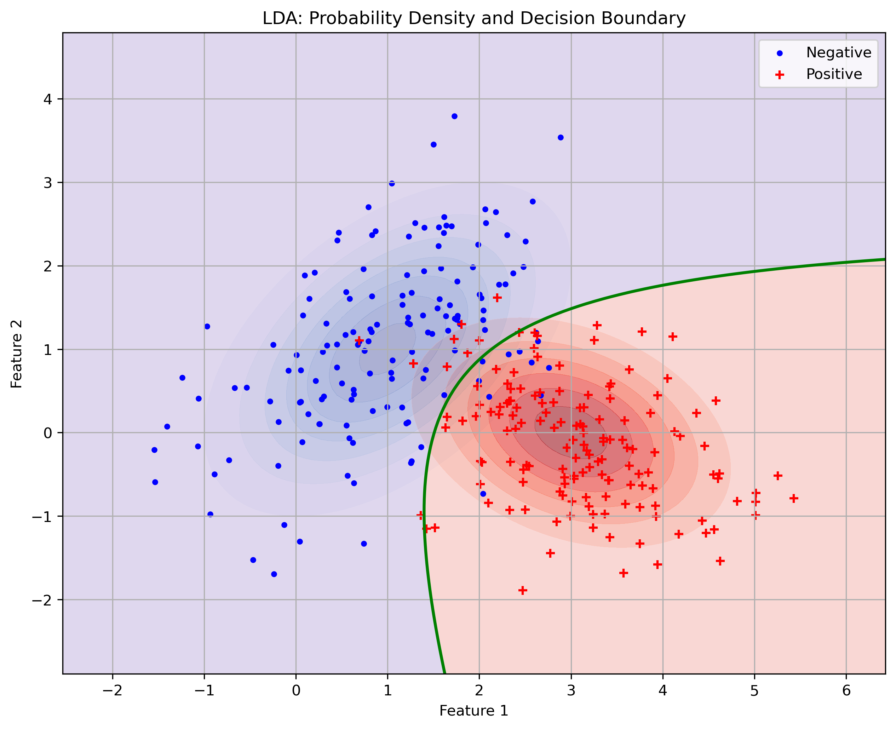
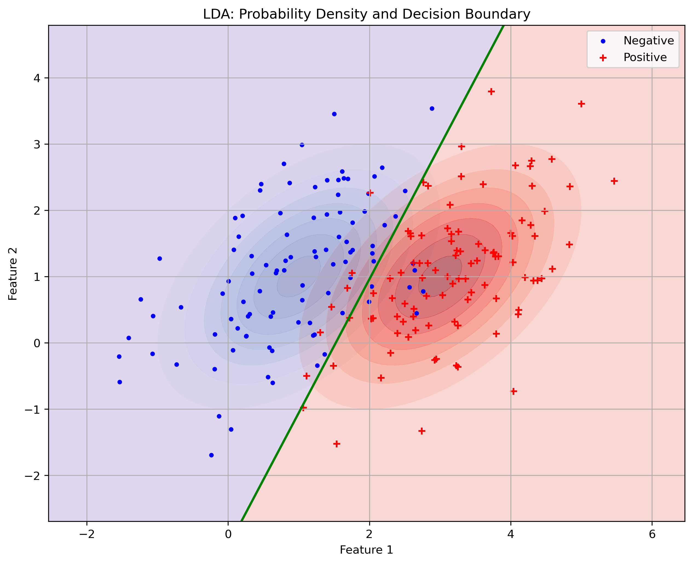

# Gaussian Bayes Classifiers

In (two-class) logistic regression, we used the discriminative modeling $p(y \vert \mathbf{x})$​ by assuming Bernoulli-distributed label noises. Now, we will use generative approach to solve classification problems.

Some philosophy:

* **Discriminative modeling**: estimate $p(y \vert \mathbf{x})$. Used both in regression and classification. Examples:
  * House prices depend on area and location.
  * Whether a meal is healthy depends on its ingredients.
* **Generative modeling**: estimate $p( \mathbf{x},y)=p(y)p(\mathbf{x} \vert y)$. Once we estimated $p( \mathbf{x},y)$, we can use the Bayes rule to derive $p( y \vert \mathbf{x})$, which is used for prediction. Mostly used in classification. Examples:
  * Species "generates" features like size, weight, color.
  * Integers "generates" images of hand-written digits.

[toc]

Notation:

* $\square_{1:N}$ is short for $\square_1, \dots, \square_N$.
* $\mathbf{x}_{n, j}$ is the $j$-th component of the $n$-th feature vector $\mathbf{x}_n$​.
* $j$ iterates over feature components, ranging in $1,\dots,d$.
* $n$ iterates over training samples, ranging in $1,\dots,N$.
* $k$ iterates over classes, ranging in $1,\dots,K$.

## Gaussian Generative Model

We model the joint distribution as
> $$
> \begin{align}
> p(\mathbf{x}, y) = \pi_y \mathcal{N}(\mathbf{x} \vert \mu_y, \Sigma_y),\quad \mathbf{x}\in\mathbb{R}^d,  y\in\{ 1,\dots, K \}
> \end{align}
> $$

Remark:

* The class label $Y$ has the categorical prior distribution
    > $$
    > p(y) = \pi_y, \quad y\in\{ 1,\dots, K \}
    > $$
* Conditioned on $y$, the feature vector $X$ is generated by Gaussian distribution
    > $$
    > p(\mathbf{x} \vert y) = \mathcal{N}(\mathbf{x} \vert \mu_y, \Sigma_y)
    > $$
* Model parameters: $\{ \pi_{1:K}\in\mathbb{R},\: \mu_{1:K}\in\mathbb{R}^{d},\: \Sigma_{1:K}\in\mathbb{R}^{d\times d}\}$.
* \#parameters: $\mathcal{O}(Kd^2)$.

We would like to answer the questions

1. How to predict class label using Gaussian generative model?  $\to$ maximize discriminant function.
1. How to derive decision boundaries from Gaussian generative model? $\to$ equalize discriminant function
1. How to estimate model parameters? $\to$ MLE, regularization, etc.

## Gaussian Bayes Classifier

The classifier derived from the Gaussian generative model is called **Gaussian Bayes Classifier** (GBC) or **Gaussian Discriminant Analysis** (GDA). Given a data point $\mathbf{x}$, we can calculate the posterior class probability using
$$
p(y \vert \mathbf{x})
= \frac{p(\mathbf{x}, y)}{p(\mathbf{x})}
= \frac{ \pi_y \mathcal{N}(\mathbf{x} \vert \mu_y, \Sigma_y)}
       { \sum_{k=1}^K \pi_k \mathcal{N}(\mathbf{x} \vert \mu_k, \Sigma_k)}
$$

The predicted label is obtained by maximizing the posterior class probability $p(y \vert \mathbf{x})$, which is equivalent to maximizing the joint probability $p(\mathbf{x}, y)$
> $$
> \DeclareMathOperator*{\argmax}{argmax}
> \DeclareMathOperator*{\argmin}{argmin}
> \hat y = \argmax_{y\in\{ 1,\dots, K \}} p(y \vert \mathbf{x})
>        = \argmax_{y\in\{ 1,\dots, K \}} p(\mathbf{x}, y)
> $$

### Discriminant Function

In practice, we maximize the log of $p(\mathbf{x}, y)$ since it is easier to calculate.

$$
\begin{align}
  \hat y
  &= \argmax_{y\in\{ 1,\dots, K \}} \ln p(\mathbf{x}, y) \\
  &= \argmax_{y\in\{ 1,\dots, K \}} \ln\pi_y - \frac{1}{2}\ln\vert\Sigma_y\vert - \frac{1}{2} (\mathbf{x} - \mu_y)^\top \Sigma_y^{-1} (\mathbf{x} - \mu_y) \\
\end{align}
$$

This motives us to define the ***discriminant function***s

> $$
> \begin{align}
>   \delta_k(\mathbf{x})
>   & = \ln\pi_k - \frac{1}{2}\ln\vert\Sigma_k\vert - \frac{1}{2} (\mathbf{x} - \mu_k)^\top  \Sigma_k^{-1} (\mathbf{x} - \mu_k) \\
>   \forall k &\in \{ 1,\dots, K \} \nonumber
> \end{align}
> $$

Remark:

* In general, $\delta_k(\mathbf{x})$ is quadratic in $\mathbf{x}$. Later, we will see that $\delta_k(\mathbf{x})$ can be simplified under certain additional assumptions.

* $\delta_k(\mathbf{x})$ is almost the same as $\ln p(\mathbf{x}, k)$ up to some constant. It quantifies how likely a test sample $\mathbf{x}$ belongs to class $k$. From now on, instead if working with $p(k \vert \mathbf{x})$, we work with $\delta_k(\mathbf{x})$​.
  $$
  \text{old: }\max_k
  \boxed{p(k \,\vert\, \mathbf{x})}
  \xrightarrow{\:\text{scaling factor}\:}
  p(\mathbf{x}, k)
  \xrightarrow{\:\log\:}
  \ln p(\mathbf{x}, k)
  \xrightarrow{\:\text{additive const}\:}
  \boxed{\delta_k(\mathbf{x})}
  \text{ new objective}
  $$

* $\delta_k(\mathbf{x})$ would be very high if
  * $\pi_k$ is high. $\iff$ High prior belief on class $k$.
  * $\vert\Sigma_k\vert$ is small. $\iff$ Low variance. i.e. The feature generated by class $k$ is very concentrated around $\mu_k$.
  * $(\mathbf{x} - \mu_k)^\top  \Sigma_k^{-1} (\mathbf{x} - \mu_k)$ is small $\iff$ The input $\mathbf{x}$ and class centre $\mu_k$ are close w.r.t. Mahalanobis distance. (c.f. Appendix)

By maximizing $\delta_k(\mathbf{x})$ over all classes, we can predict the label of a test input $\mathbf{x}$
> $$
> \begin{align}
> \hat y = \argmax_{k\in\{ 1,\dots, K \}} \delta_k(\mathbf{x})
> \end{align}
> $$

### Decision Boundary

The ***decision boundary*** between two classes $k$ and $l$ consists of those $\mathbf{x}$ where the discriminant functions of class $k$ and $l$ are evaluated the same.

> $$
> \begin{align}
> \left\{ \mathbf{x}\in\mathbb{R}^d : \delta_k(\mathbf{x}) = \delta_l(\mathbf{x}) \right\}
> \end{align}
> $$

The criterion $\delta_k(\mathbf{x}) = \delta_l(\mathbf{x})$ is equivalent to

> $$
> \begin{align}
>   \frac{1}{2} \left[
>      (\mathbf{x} - \mu_k)^\top  \Sigma_k^{-1} (\mathbf{x} - \mu_k)
>     -(\mathbf{x} - \mu_l)^\top  \Sigma_l^{-1} (\mathbf{x} - \mu_l)
>     +\ln\frac{\vert\Sigma_k\vert}{\vert\Sigma_l\vert}
>   \right] - \ln\frac{\pi_k}{\pi_l} =0
> \end{align}
> $$

Remark:

* In general, the decision boundary between two classes $k$ and $l$ is a quadratic hypersurface in $\mathbb{R}^d$. Later, we will see that the decision boudary can be simplified under certain additional assumptions.
* For two-class problems, simply let $k=+1$ and $l=-1$.

### LLR and LOR

For two-class problems, $y\in\{+1, -1\}$. To make the notation more concise, we use $p(+\vert\mathbf{x})$ to denote $p(Y=+1\vert\mathbf{x})$, etc. There are only two discrimiant functions: $\delta_{+}(\mathbf{x})$ and $\delta_{-}(\mathbf{x})$. To predict the class label, we simply compare  $\delta_{+}(\mathbf{x})$ and $\delta_{-}(\mathbf{x})$, or equivalently examine the sign of $\delta_{+}(\mathbf{x}) - \delta_{-}(\mathbf{x})$.

The ***log likelihood ratio*** (LLR) is defined as
> $$
> \begin{align}
> \mathrm{LLR}(\mathbf{x}) = \ln \frac{p(\mathbf{x} \vert +)}{p(\mathbf{x} \vert -)}
> \end{align}
> $$

The ***log-odds ratio*** (LOR) is defined as

> $$
> \begin{align}
> \mathrm{LOR}(\mathbf{x}) = \ln \frac{p(+ \vert \mathbf{x})}{p(- \vert \mathbf{x})}
> \end{align}
> $$

Remark:

* Bad name warning: log-odds is just the log of posterior ratio. The term *odds* here has nothing to do with odd numbers or any "oddness". In some literature, the term *discriminant function* is defined as log-odds.
* The class label is predicted by $\hat y = \operatorname{sign}(\mathrm{LOR}(\mathbf{x}))$.
* The decision boundary is $\{\mathbf{x}\in\mathbb{R}^d: \mathrm{LOR}(\mathbf{x}) = 0 \}$.
* The log-odds coincides with LLR if the priors are the same, i.e. $\pi_+ = \pi_-$.

The log-odds is closely related to discriminant functions
>$$
>\begin{align}
>\mathrm{LOR}(\mathbf{x}) = \delta_{+}(\mathbf{x}) - \delta_{-}(\mathbf{x})
>\end{align}
>$$

*Proof*: Express the LOR in terms of the joint probability
$$
\begin{align*}
\mathrm{LOR}(\mathbf{x})
&= \ln \frac{p(+\vert\mathbf{x})}{p(-\vert\mathbf{x})}
= \ln \frac{p(\mathbf{x}, +)\Big/p(\mathbf{x})}{p(\mathbf{x}, -)\Big/p(\mathbf{x})}
= \ln \frac{p(\mathbf{x}, +)}{p(\mathbf{x}, -)} \\
&= \ln p(\mathbf{x}, +) - \ln p(\mathbf{x}, -) \\
&= \delta_{+}(\mathbf{x}) - \delta_{-}(\mathbf{x}) \\
\end{align*}
$$
where the last step follows from the fact that the discriminant functions are almost the same as the log of joint probability up to an additive constant. $\quad\quad\quad\square$

The log-odds is closely related to logistic regression

> $$
> \begin{align}
> p(+ \vert \mathbf{x})
> &= \sigma(\mathrm{LOR}(\mathbf{x})) \\
> &= \frac{1}{1+\exp(-\mathrm{LOR}(\mathbf{x}))}
> \end{align}
> $$

*Proof*: By the law of total probability $p(+ \vert \mathbf{x}) + p(- \vert \mathbf{x}) = 1$, we have
$$
\mathrm{LOR}(\mathbf{x}) = \ln \frac{p(+ \vert \mathbf{x})}{1-p(+ \vert \mathbf{x})}
$$
Taking the exponent on both side yields
$$
\exp(\mathrm{LOR}(\mathbf{x})) = \frac{p(+ \vert \mathbf{x})}{1-p(+ \vert \mathbf{x})}
$$

Rearranging the terms, we conclude. $\quad\quad\quad\square$

Next, we will examine two special cases of GBC under simplified assumptions:

* **Linear Discriminant Analysis** (LDA): All covariance matrices $\Sigma_1, \dots, \Sigma_K$ are the **same** (but not neccessarily diagonal).
* **Gaussian Naive Bayes** (GNB): All covariance matrices $\Sigma_1, \dots, \Sigma_K$ are **diagonal** matrices (but not neccessarily the same), which implies that the features are statistically independent. Recall: For Gaussian rand var, uncorelatednes $\iff$ independence).

## Linear Discriminant Analysis

The Gaussian Bayes classifier becomes LDA classfifier if $\Sigma_1 = \dots = \Sigma_K = \Sigma$. The model is thus simplified to
> $$
> \begin{align}
> p(\mathbf{x}, y) = \pi_y \mathcal{N}(\mathbf{x} \vert \mu_y, \Sigma)
> \end{align}
> $$

Remark:

* The contour lines of $p(\mathbf{x} \vert 1), \dots, p(\mathbf{x} \vert K)$ are the same.
* Model parameters: $\{ \pi_{1:K}\in\mathbb{R},\: \mu_{1:K}\in\mathbb{R}^{d},\: \Sigma\in\mathbb{R}^{d\times d}\}$.
* \#parameters: $\mathcal{O}(Kd)$ for low-dimensional data. $\mathcal{O}(d^2)$ for high-dimensional data.
* LDA has regularisation effect by nature since it has fewer parameters than a general GBC. (similar to drop-out in NN)

The discriminant functions of LDA classifiers are simplified to **linear** (or affine) functions

> $$
> \begin{align}
> \delta_k(\mathbf{x})
> &= \mathbf{x}^\top \Sigma^{-1}\mu_k - \frac{1}{2}\mu_k^\top\Sigma^{-1}\mu_k + \ln\pi_k \\
> \forall k &\in \{ 1,\dots, K \} \nonumber
> \end{align}
> $$

Remark:

* For LDA, we get linear discriminant functions, i.e. $\delta_k(\mathbf{x}) = \mathbf{x}^\top \mathbf{w}_k + b_k$ where
  * $\mathbf{w}_k \triangleq \Sigma^{-1}\mu_k \in\mathbb{R}^d$
  * $b_k = - \frac{1}{2}\mu_k^\top\Sigma^{-1}\mu_k + \ln\pi_k \in\mathbb{R}$​
* $\delta_k(\mathbf{x})$ is large if
  * $\mathbf{x}^\top \Sigma^{-1}\mu_k$ is large $\iff$ $\mathbf{x}$  aligns more closely with $\mu_k$ w.r.t. the inner product $\langle \mathbf{v},\mathbf{w} \rangle_{\Sigma} = \mathbf{v}^\top \Sigma^{-1} \mathbf{w}$.
  * $\mu_k^\top\Sigma^{-1}\mu_k$ is small $\iff$ $\mu_k$ is small w.r.t. the Mahalanobis norm $\Vert \mathbf{v} \Vert_{\Sigma} = \mathbf{v}^\top \Sigma^{-1} \mathbf{v}$.
  * $\ln\pi_k$ is large $\iff$ strong prior belief on class $k$.

*Proof*: Just let $\Sigma_k = \Sigma$ and igonore those terms which are independent of $k$.
$$
\delta_k(\mathbf{x}) = \ln\pi_k - \frac{1}{2}\ln\vert\Sigma\vert - \frac{1}{2} (\mathbf{x} - \mu_k)^\top  \Sigma^{-1} (\mathbf{x} - \mu_k) \\
$$
Ignoring $\ln\vert\Sigma\vert$ and expanding the Mahalanobis norm, we get
$$
\delta_k(\mathbf{x})
= \ln\pi_k - \frac{1}{2} \left(
 \mathbf{x}^\top \Sigma^{-1} \mathbf{x} -
 \mathbf{x}^\top \Sigma^{-1} \mu_k -
 \mu_k^\top \Sigma^{-1} \mathbf{x} +
 \mu_k^\top \Sigma^{-1} \mu_k
\right)
$$
Ignoring $\mathbf{x}^\top \Sigma^{-1} \mathbf{x}$ and exploiting the fact that $\mu_k^\top \Sigma^{-1} \mathbf{x} = \mathbf{x}^\top \Sigma^{-1} \mu_k$, we conclude. $\quad\square$

The decision boundary between class $k$ and $l$ is simplified to **hyperplane**.

>$$
>\mathbf{x}^\top \Sigma^{-1}(\mu_k - \mu_l) - \frac{1}{2}\left(\mu_k^\top\Sigma^{-1}\mu_k - \mu_l^\top\Sigma^{-1}\mu_l \right) + \ln\frac{\pi_k}{\pi_l} = 0
>$$

Remark:

* If $\Sigma = \sigma^2 I$, the normal vector of the hyperplane becomes parallel to $\mu_k - \mu_l$​.
* The offset (or bias) of the hyperplane depends on
  * Difference in the norms $\Vert \mu_k \Vert_{\Sigma}$ and $\Vert \mu_l \Vert_{\Sigma}$ 
  * Difference in prior beliefs on class $k$ and $l$
* If $\pi_k=\pi_l$, the hyperplane goes through the middle of the class centres $\dfrac{\mu_k + \mu_l}{2}$.

*Proof*: Plugging the linear discriminant fucntions into $\delta_k(\mathbf{x}) = \delta_l(\mathbf{x})$, we conclude. $\quad\square$​​

### Transformed Data Space

Now, we analyze the deicsion boundary of LDA in transformed data space to get more insights. For that, we need some tools from linear algebra.

The matrix $\Sigma^{-1}$​ is symmetric positive definite and thus has matrix root (c.f. Appendix). i.e.
$$
\exist S\in\mathbb{R}^{d\times d} \text{ s.p.d.} \quad\text{s.t.} \quad \Sigma^{-1} = S^2
$$
 The hyperplane becomes
$$
\begin{align*}
\mathbf{x}^\top S^2 (\mu_k - \mu_l) - \frac{1}{2}\left(\mu_k^\top S^2 \mu_k - \mu_l^\top S^2 \mu_l \right) + \ln\frac{\pi_k}{\pi_l} &= 0 \\
(S\mathbf{x})^\top (S\mu_k - S\mu_l) - \frac{1}{2}\left[(S\mu_k)^\top (S\mu_k) - (S\mu_l)^\top (S\mu_l) \right] + \ln\frac{\pi_k}{\pi_l} &= 0 \\
\end{align*}
$$

Define the linear transformation
$$
\begin{align}
\tilde{\mathbf{x}} = S\mathbf{x}
\end{align}
$$

The hyperplane has simpler form in the transformed space as
> $$
> \begin{align}
> \tilde{\mathbf{x}}^\top (\tilde{\mu}_k - \tilde{\mu}_l)
> -\frac{1}{2}\left( \big\Vert \tilde{\mu}_k \big\Vert^2 -  \big\Vert \tilde{\mu}_l \big\Vert^2 \right)
> +\ln\frac{\pi_k}{\pi_l} = 0 \\
> \end{align}
> $$

which is just $\tilde{\mathbf{x}}^\top \tilde{\mathbf{w}} + \tilde{b} = 0$ with

$$
\tilde{\mathbf{w}} = \tilde{\mu}_k - \tilde{\mu}_l,
\quad
\tilde{b} = -\frac{1}{2}\left( \big\Vert \tilde{\mu}_k \big\Vert^2 -  \big\Vert \tilde{\mu}_l \big\Vert^2\right) + \ln\frac{\pi_k}{\pi_l}
$$

### Data Imbalance

The data is called **balanced** if the prior class probabilities are about the same $\pi_1 \approx \dots \approx \pi_K$. In our fish sorting example, the fish data set is balanced if there are roughly equal numbers of salmon and sea bass. In email filtering example, the data could be imbalanced as there is more non-spam emails than spam emails.

* For balanced data set, the LDA decision boundary between class $k$ and $l$ lies in the middle of class centres. Thus, $\tilde{\mu}_k$ and $\tilde{\mu}_l$ have the same Euclidean distance to the decision boundary, which has similar idea as max margin classifier (c.f. Support Vector Machine).

* For imbalanced data set, say $\pi_k > \pi_l$, the decision boundary is "shifted towards" the less populous class $l$. As a result, if a test sample $\tilde{\mathbf{x}}$ lies somewhere in the middle of $\tilde{\mu}_k$ and $\tilde{\mu}_l$, the LDA classifier tend to believe more that $\tilde{\mathbf{x}}$ is generated by more populous class $k$. Hence, minority could be misclassfied as majority.

Is this effect "good"?

## LDA with Naive Bayes

Now, let's consider a special case of LDA where all covariance matrices $\Sigma_1, \dots, \Sigma_K$ are **diagonal** (i.e. Naive Bayes assumption). Together, we assume that
$$
\Sigma_{1} = \dots = \Sigma_{K} = \operatorname{diag}(\sigma_{1}^2, \dots, \sigma_{d}^2)
$$
The discriminant Function is simplified to
$$
\delta_k(\mathbf{x})
=  
\sum_{j=1}^d \sigma_j^{-2} \mu_{k,j} \mathbf{x}_j  
-\frac{1}{2} \sum_{j=1}^d \sigma_j^{-2}\mu_{k,j}^2  + \ln\pi_k \\
$$
*Proof*: Exercise. Simply start from the discriminant function of LDA and use the naive Bayes assumption.

Decision Boundary is simplified to
$$
\mathbf{w^\top x} + b = 0
$$
where
$$
\mathbf{w}_j = \frac{\mu_{k,j} - \mu_{l,j}}{\sigma_j^2},\quad
b = \ln\frac{\pi_k}{\pi_l} - \frac{1}{2} \sum_{j=1}^d \frac{\mu_{k,j}^2 - \mu_{l,j}^2}{\sigma_j^2}
$$
*Proof*: Exercise. Simply let $\delta_k(\mathbf{x}) = \delta_l(\mathbf{x})$.

LLR and LOR is simplified to

## Learning Gaussian Bayes Classifiers

So far, we derived the decision rule by assuming the model parameters are known. In practice, the model parameters should be estimated from training data. The section shows the related parameter estimation in greater detail.

* Given: data set $(\mathbf{x}_1, y_1), \dots, (\mathbf{x}_N, y_N) \in \mathbb{R}^d \times \{1, \dots, K\}$.
* Generative model: $p( \mathbf{x},y \vert \theta) = {\pi_y} {\mathcal{N}(\mathbf{x} \vert \mu_y, \Sigma_y)}$.
* Assume: all $(\mathbf{x}_n, y_n)$ are drawn iid from $p( \mathbf{x},y \vert \theta)$.
* Goal: estimate parameters $\theta = \{ (\pi_k, \mu_k, \Sigma_k) : k=1,\dots,K \}$.

### MLE for GBC

The log-likelihood (LLH) is

> $$
> \begin{align}
> \ln p(\mathbf{x}_{1:N}, y_{1:N} \vert \theta)
> &= \ln \prod_{n=1}^N p(\mathbf{x}_{n}, y_{n} \vert \theta) \\
> &= \sum_{n=1}^N \ln\pi_{y_n} + \ln \mathcal{N}(\mathbf{x}_{n} \vert \mu_{y_n}, \Sigma_{y_n})
> \end{align}
> $$

*Proof*: Using the iid assumption and Gaussian generative model, we get
$$
\begin{align*}
\ln p(\mathbf{x}_{1:N}, y_{1:N} \vert \theta)
&= \ln \prod_{n=1}^N p(\mathbf{x}_{n}, y_{n} \vert \theta)
&& \text{iid samples}
\\
&= \sum_{n=1}^N \ln  p(\mathbf{x}_{n}, y_{n} \vert \theta)
&& \text{property of log}
\\
&= \sum_{n=1}^N \ln  p(y_{n} \vert \theta) + \ln  p(\mathbf{x}_{n} \vert y_{n}, \theta)
&& \text{chain rule}
\\
&= \sum_{n=1}^N \ln  p(y_{n} \vert \pi_{1:K}) + \ln  p(\mathbf{x}_{n} \vert y_{n}, \mu_{1:K}, \Sigma_{1:K})
&& \text{separate parametrization}
\\
&= \sum_{n=1}^N \ln\pi_{y_n} + \ln \mathcal{N}(\mathbf{x}_{n} \vert \mu_{y_n}, \Sigma_{y_n})
&& \text{plug in PDFs} \quad\quad\quad\quad \square
\end{align*}
$$

Now comes the trick: Note that $\forall n = 1,\dots, N$, $y_n\in\{1,\dots, K\}$. Instead of summing over training samples, we sum over classes.

Formally, this is done by using indicator function (c.f. Appendix).
$$
\begin{align*}
\ln p(\mathbf{x}_{1:N}, y_{1:N} \vert \theta)
&=  \sum_{n=1}^N \sum_{k=1}^K \mathbb{I}[y_n = k] \left(
  \ln\pi_{k} + \ln \mathcal{N}(\mathbf{x}_{n} \vert \mu_{k}, \Sigma_{k})
 \right) &\text{c.f. Appendix}\\
&=  \sum_{k=1}^K \sum_{n=1}^N \mathbb{I}[y_n = k] \ln\pi_{k} +
 \sum_{k=1}^K \sum_{n=1}^N \mathbb{I}[y_n = k] \ln \mathcal{N}(\mathbf{x}_{n} \vert \mu_{k}, \Sigma_{k})
 &\text{switch order} \\
&=  \sum_{k=1}^K \ln\pi_{k} \underbrace{\sum_{n=1}^N \mathbb{I}[y_n = k]}_{N_k} +
 \sum_{k=1}^K \sum_{n=1}^N \mathbb{I}[y_n = k] \ln \mathcal{N}(\mathbf{x}_{n} \vert \mu_{k}, \Sigma_{k}) \\
\end{align*}
$$

Let $N_k \triangleq \sum_{n=1}^N \mathbb{I}[y_n = k] = \#k \text{ in } y_{1:N}$. We simply the LLH to

>$$
>\begin{align}
>\ln p(\mathbf{x}_{1:N}, y_{1:N} \vert \theta)
>&=  \sum_{k=1}^K N_k \ln\pi_{k} +
> \sum_{k=1}^K \sum_{n=1}^N \mathbb{I}[y_n = k] \ln \mathcal{N}(\mathbf{x}_{n} \vert \mu_{k}, \Sigma_{k}) \\
>\end{align}
>$$

Remark:

* **Why summing over classes?** To get an expression which explicitly depends on parameters $\pi_k, \mu_k, \Sigma_k$.

* **Why does the trick work?** Intutition: Imagine you have dozens of coins and you want to know their total value. Instead of summing up all the coins one by one, you count the number of one-dollar coins, half-dollar coins, etc., and then sum up the totals for each category.

The MLE for GBC: $\forall k = 1,\dots, K$

>Class probability:
>$$
>\begin{align}
>\hat\pi_k = \frac{\sum_{n=1}^N \mathbb{I}[y_n = k]}{N}
>\end{align}
>$$
>Gaussian parameters:
>$$
>\begin{align}
>\hat\mu_k &= \frac{1}{\sum_{n=1}^N \mathbb{I}[y_n = k]} \sum_{n=1}^N \mathbb{I}[y_n = k] \mathbf{x}_n \\
>\hat\Sigma_k &= \frac{1}{\sum_{n=1}^N \mathbb{I}[y_n = k]} \sum_{n=1}^N \mathbb{I}[y_n = k] (\mathbf{x}_n - \hat\mu)(\mathbf{x}_n - \hat\mu)^\top \\
>\end{align}
>$$
>

Remark:

* The term $\sum_{n=1}^N \mathbb{I}[y_n = k]$ simply counts how many training samples are labeled in class $k$.

*Proof*: Here, we only prove the formula of $\hat{\pi}_k$. For $\hat\mu_k$ and $\hat\Sigma_k$, c.f. *Everything about Gaussian Distribution*.

### MLE for LDA

TODO

### MLE for GNB

TODO

# Exercise

1. **Multi Choice**: Gaussian Naive Bayes model is
    * [ ] a type of generative model
    * [ ] a type of discriminative model
    * [ ] used for superivsed learning
    * [ ] used for unsuperivsed learning

    

1. **Quadratic Form**: Let $A\in\mathbb{R}^{d \times d}$ be a symmetric matrix. Show that
    $$
    \forall \mathbf{x}, \mathbf{y}\in\mathbb{R}^d,\quad
    \mathbf{x}^\top A \mathbf{y} = \mathbf{y}^\top A \mathbf{x}
    $$
    
1. **Decision Boundary LDA**: The deicsion boundary between class $k$ and $l$​ is given by
    $$
    \mathbf{x}^\top \Sigma^{-1}(\mu_k - \mu_l) - \frac{1}{2}\left(\mu_k^\top\Sigma^{-1}\mu_k - \mu_l^\top\Sigma^{-1}\mu_l \right) + \ln\frac{\pi_k}{\pi_l} = 0
    $$
    **a)** Verify that the decision boundary goes through the mid point $\frac{\mu_k+\mu_l}{2}$ if $\pi_k=\pi_l$.

    **b)** Does the above result also hold for a general Gaussian Bayes classifier? Justify your answer.

    

1. **LDA with Naive Bayes**: Derive the formulas of discriminant Function and decision boundary.

    

1. **LDA Classifier**: Suppose you learned a LDA classifier for two classes $\{+, - \}$ and you found out that
    $$
    \pi_+ = \pi_-, \quad
    \mu_+ = \begin{bmatrix} 4 \\ 3 \end{bmatrix}, \quad
    \mu_- = \begin{bmatrix} 0 \\ 1 \end{bmatrix}, \quad
    \Sigma = \begin{bmatrix}1 & 0.5 \\ \sigma_{2,1} & 1\end{bmatrix}, \quad
    $$
    **a)** What is the value of $\sigma_{2,1}$? Justify your answer.

    **b)** Calculate the decision boundary from the above parameters.

    **c)** Predict the class label for the test data point $\mathbf{x}=[2, \, 0]^\top$.

    

1. **Naive Bayes Classifier**: Suppose you learned a **naive** Bayes model for two features $(x_1, x_2)$ and two classes $\{+, - \}$. After estimating all parameters, you found out that prior class proability for *positive* is $p(+) = 0.6$.

    **a)** Calculate the prior class probability for *negative* $p(-)$​.

    Now, you would like to classify a data point $(1, 2)$. Using the naive Bayes model you have learned, you found out the likelihood for each feature component
    $$
    \begin{align*}
    p(X_1 = 1 \,\vert\, + ) &= 0.2 &\quad p(X_1 = 1 \,\vert\, - ) &= 0.5 \\
    p(X_2 = 2 \,\vert\, + ) &= 0.7 &\quad p(X_2 = 2 \,\vert\, - ) &= 0.3 \\
    \end{align*}
    $$
    **b)** Calculate the joint likelihood $p(X_1 = 1, X_2 = 2 \,\vert\, +)$

    **c)** Calculate the posterior class probability $p(+ \vert X_1=1, X_2=1)$​

    **d)** Would you classify the data point $(1, 2)$ as *positive* or *negative*? Justify your answer.

# Appendix

## Precision Matrix Decomposition

Some important results from linear algebra, which is important for decomposing the precision matrix $\Sigma^{-1}$.

1. A real symmetric matrix is orthogonally diagonalizable. All its eigenvalues are real.
    > $$
    > A=A^\top
    > \implies A = Q^\top DQ
    > $$
    > where $Q$ is an orthogonal matrix and $D$ is a real diagonal matrix.
1. Eigenvalues of a positive definite matrix are all strictly positive.
1. A real symmetric positive definite (s.p.d.) matrix can be decomposed in two ways
    > $$
    > \begin{align}
    > A \:\text{ s.p.d.} \implies A&=BB^\top, \:\text{ or }\\
    > A &= R^2 \:\text{ where } R \text{ is p.s.d.} 
    > \end{align}
    > $$
    > where $R$ is called the matrix root of $A$.
1. The precision matrix $\Sigma^{-1}$ is s.p.d. and thus has matrix decompositions in 3.

*Proof 1*: First, we show the eigenvalues of a symmetric matrix is real by
$$
\begin{align*}
\text{Let } Av=\lambda v
&\implies
  \langle Av, Av \rangle
  = \langle \lambda v, \lambda v \rangle
  =  \lambda^2 \langle v, v \rangle \\
&\implies
  \lambda^2 = \frac{ \langle Av, Av \rangle}{\langle v, v \rangle} > 0 \\
&\implies
  \lambda \in\mathbb{R}
\end{align*}
$$

Second, we show eigenspaces corresponding to distinct eigenvalues are mutually orthogonal.  
Suppose $Av=\lambda v,\: Aw=\eta w$ and $\lambda\ne\eta$. Then,
$$
\begin{align*}
\langle Av, w \rangle &= \langle \lambda v, w \rangle = \lambda \langle v, w \rangle \\
\langle v, Aw \rangle &= \langle v, \eta w \rangle    = \eta \langle v, w \rangle
\end{align*}
$$

Recall: $A$ is symmetric $\implies \langle Av, w \rangle = \langle v, Aw \rangle$. Hence,
$$
\begin{align*}
\lambda \langle v, w \rangle = \eta \langle v, w \rangle 
&\implies
  (\lambda - \eta) \langle v, w \rangle =0 \\
&\implies
  \langle v, w \rangle =0 && \text{since }\lambda\ne\eta \\
\end{align*}
$$

In each eigenspace, we choose an orthogonal basis. Basis vectors from different eigenspaces are again orthogonal to each other. We conclude. $\quad\square$

*Proof 2*: Let $A$ be positive definite. Let $Ax=\lambda x$, then
$$
x^\top Ax  = \lambda \Vert x \Vert^2 > 0 \implies \lambda > 0 \quad\square
$$

*Proof 3*:  Let $A$ be s.p.d. Combining the results from 1 and 2, we get the eigen decomposition
$$
A = Q^\top DQ
$$
where

* $Q$ is an orthogonal matrix, i.e. $Q^\top Q = QQ^\top = I$
* $D$ is diagonal with positive elements.

Let $D^{\frac 12}$ denote the elementwise square root of $D$
$$
D^{\frac 12} \triangleq \left[ \sqrt{D_{ij}} \right]_{ij} \implies D = D^{\frac 12} D^{\frac 12}
$$

The matrix root is then $R=Q^\top D^{\frac 12} Q$ since
$$
A 
= \underbrace{Q^\top D^{\frac 12}}_{B^\top} \cdot \underbrace{D^{\frac 12} Q}_{B \vphantom{XXX^\top}}
= \underbrace{Q^\top D^{\frac 12} Q}_{R} \cdot \underbrace{Q^\top D^{\frac 12} Q}_{R}
$$

The symmetry of $R$ is obvious. $\quad\quad\quad\square$

## Mahalanobis Distance

Let $\Sigma\in\mathbb R^{d \times d}$ be a covariance matrix. The Mahalanobis distance between two points $u,v \in\mathbb R^d$ is defined as

$$
\begin{align}
d(u,v) = \sqrt{(u-v)^\top \Sigma^{-1} (u-v)}
\end{align}
$$

$\Sigma^{-1}$ has a p.s.d. matrix square root $S$ (see *Precision Matrix Decomposition*). Under the linear transformation defined by $S$, the Mahalanobis distance becomes the standard Euclidean distance between the transformed points.

$$
\begin{align}
d(u,v)
&= \sqrt{(u-v)^\top S^2 (u-v)} && \Sigma^{-1} = S^2 \\
&= \sqrt{(u-v)^\top S^\top \cdot S (u-v)} && S^\top = S \\
&= \Vert S (u-v) \Vert_2 && \text{def. of 2 norm} \\
&= \Vert \tilde u -\tilde v \Vert_2  && \text{where } \tilde u = Su, \tilde v = Sv\\
\end{align}
$$

## Indicator Function

The indicator function $\mathbb{I}[\cdot]$ is defined by
> $$
> \mathbb{I}[\mathrm{assertion}] =
> \begin{cases}
> 1 & \text{if } \mathrm{assertion} \text{ is true}\\
> 0 & \text{if } \mathrm{assertion} \text{ is false}\\
> \end{cases}
> $$

Examples:

* $\mathbb{I}[3=5] = 0$.
* $\mathbb{I}[\text{19 is a prime number}] = 1$.

> Let $y\in\{1, \dots, K\}$ and $f(\cdot)$ be any real-valued function. Then,
> $$
> f(y) = \sum_{k=1}^K \mathbb{I}[y=k] \cdot f(k)
> $$
